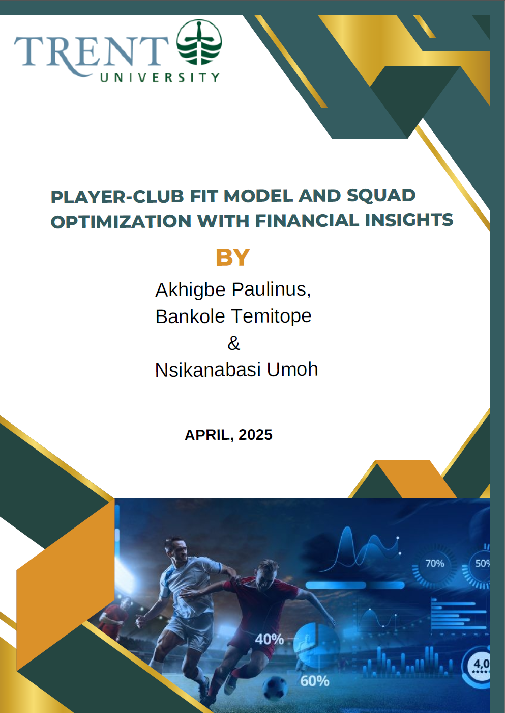

<p align="center">
  
</p>

# ⚽ Player-Club Fit Analyzer 
*"Moneyball meets Football Tactics" - Your personal squad optimizer*

[](https://your-app-link.com) 
[](https://python.org)
[](https://reactjs.org)

## 🎯 What It Does
A **machine learning-powered** tool that helps football clubs:
- 🔍 **Find perfect player matches** using K-Means clustering
- 💰 **Optimize transfers** with financial ROI analysis
- 📊 **Visualize gaps** in squad composition

Built for my MSc Final Project with real-world football data sourced from FBref and Transfermarkt

## 🛠️ Tech Stack
| Area       | Technologies Used |
|------------|-------------------|
| **Backend** | Python, Flask, Scikit-learn, Pandas |
| **Frontend**| React.js, Tailwind CSS |
| **Data**    | Transfermarkt + FBref datasets |

## 📂 Project Structure
```bash
.
├── backend/          # The brains: ML models & API
│   ├── app.py        # Flask endpoints
│   ├── player_analysis.py  # Magic happens here
│   └── data.csv      # 3,500+ player records
│
└── frontend/         # Sleek dashboard
    ├── components/   # Interactive visuals
    └── lib/          # Data processing logic
